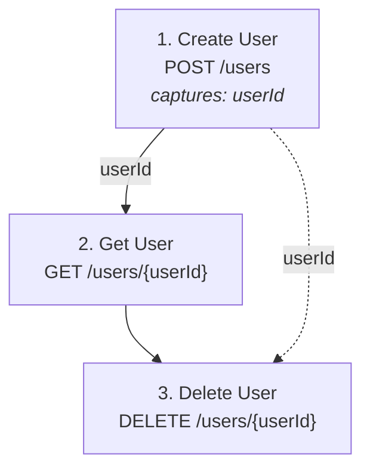

# v2 Core Modules Specification

## Overview

This document specifies the new core modules introduced in v2 for scenario-based test generation.

---

## 1. PtScenarioParser

**File**: `jmeter_gen/core/ptscenario_parser.py`

### Purpose

Parse and validate `pt_scenario.yaml` files into structured data objects.

### Class Definition

```python
class PtScenarioParser:
    """Parser for pt_scenario.yaml files."""

    def __init__(self, openapi_parser: Optional[OpenAPIParser] = None):
        """Initialize parser with optional OpenAPI parser for validation."""

    def parse(self, scenario_path: str) -> ParsedScenario:
        """Parse scenario file and return structured data.

        Args:
            scenario_path: Path to pt_scenario.yaml file

        Returns:
            ParsedScenario object with all steps and configuration

        Raises:
            ScenarioParseException: If YAML parsing fails
            ScenarioValidationException: If schema validation fails
        """

    def validate(self, scenario: ParsedScenario) -> list[str]:
        """Validate scenario against OpenAPI spec.

        Returns:
            List of validation warnings (empty if valid)

        Raises:
            EndpointNotFoundException: If endpoint not in spec
            UndefinedVariableException: If variable used before definition
        """
```

### Data Classes

```python
@dataclass
class ScenarioSettings:
    threads: int = 1
    rampup: int = 0
    duration: Optional[int] = None
    base_url: Optional[str] = None

@dataclass
class CaptureConfig:
    variable_name: str
    source_field: Optional[str] = None  # If different from variable_name
    jsonpath: Optional[str] = None      # Explicit path (fallback)
    match: str = "first"                # "first", "all", or number

@dataclass
class AssertConfig:
    status: Optional[int] = None
    body: dict[str, Any] = field(default_factory=dict)
    headers: dict[str, str] = field(default_factory=dict)

@dataclass
class LoopConfig:
    count: Optional[int] = None           # Fixed iteration count
    while_condition: Optional[str] = None # JSONPath condition (e.g., "$.status != 'finished'")
    max_iterations: int = 100             # Safety limit for while loops
    interval: Optional[int] = None        # Delay between iterations (ms)

@dataclass
class ScenarioStep:
    name: str
    endpoint: str                       # Raw endpoint value from YAML
    endpoint_type: str                  # "operation_id" or "method_path"
    method: Optional[str] = None        # HTTP method (for method_path type)
    path: Optional[str] = None          # URL path (for method_path type)
    enabled: bool = True
    params: dict[str, Any] = field(default_factory=dict)
    headers: dict[str, str] = field(default_factory=dict)
    payload: Optional[dict[str, Any]] = None
    captures: list[CaptureConfig] = field(default_factory=list)
    assertions: Optional[AssertConfig] = None
    loop: Optional[LoopConfig] = None         # Loop control configuration

@dataclass
class ParsedScenario:
    version: str
    name: str
    description: Optional[str]
    settings: ScenarioSettings
    variables: dict[str, Any]
    steps: list[ScenarioStep]
```

### Capture Parsing Rules

The `capture` field supports two syntaxes:

1. **Simple capture**: `capture: [userId, orderId]`
   - Variable name = field name
   - JSONPath: `$.userId`, `$.orderId`

2. **Mapped capture**: `capture: [userId: "id", orderNum: "order.number"]`
   - Variable name mapped to different field
   - JSONPath: `$.id`, `$.order.number`

3. **Mixed**: `capture: [userId, orderNum: "order.number"]`
   - Combination of both syntaxes allowed

### Endpoint Format Detection

The parser automatically detects endpoint format:

```python
HTTP_METHODS = {"GET", "POST", "PUT", "DELETE", "PATCH", "HEAD", "OPTIONS"}

def _parse_endpoint(self, endpoint: str) -> tuple[str, Optional[str], Optional[str]]:
    """Parse endpoint string and detect format.

    Args:
        endpoint: Raw endpoint value (e.g., "createUser" or "POST /users")

    Returns:
        Tuple of (endpoint_type, method, path)
        - For operationId: ("operation_id", None, None)
        - For METHOD /path: ("method_path", "POST", "/users")

    Raises:
        InvalidEndpointFormatException: If format is invalid
    """
    parts = endpoint.split(" ", 1)
    if len(parts) == 2 and parts[0].upper() in HTTP_METHODS:
        method = parts[0].upper()
        path = parts[1]
        if not path.startswith("/"):
            raise InvalidEndpointFormatException(
                f"Path must start with '/': {endpoint}"
            )
        return ("method_path", method, path)
    else:
        # Treat as operationId
        return ("operation_id", None, None)
```

---

## 2. CorrelationAnalyzer

**File**: `jmeter_gen/core/correlation_analyzer.py`

### Purpose

Automatically detect variable correlations by analyzing OpenAPI response schemas.
Maps capture variable names to JSONPath expressions for response extraction.

### Class Definition

```python
class CorrelationAnalyzer:
    """Analyze scenarios for automatic variable correlation."""

    def __init__(self, openapi_parser: OpenAPIParser):
        """Initialize with OpenAPI parser for schema access.

        Args:
            openapi_parser: Parser instance with loaded OpenAPI spec
        """

    def analyze(self, scenario: ParsedScenario) -> CorrelationResult:
        """Analyze scenario and generate correlation mappings.

        Args:
            scenario: Parsed scenario with capture definitions

        Returns:
            CorrelationResult with mappings, warnings, and errors

        Process:
            1. For each step with captures
            2. Get response schema for endpoint
            3. Build field index from schema
            4. Match each capture to schema field
            5. Track variable usage across steps
        """

    def analyze_step(
        self,
        step: ScenarioStep,
        step_index: int
    ) -> list[CorrelationMapping]:
        """Analyze captures for a single step.

        Args:
            step: Scenario step with captures
            step_index: Step index (1-based) for source tracking

        Returns:
            List of correlation mappings for this step
        """

    def _get_response_schema(
        self,
        endpoint: str,
        endpoint_type: str
    ) -> Optional[dict]:
        """Get response schema for endpoint.

        Handles both operationId and method_path formats.
        Returns schema for 200/201 response with application/json content.
        """

    def _build_field_index(
        self,
        schema: dict,
        prefix: str = "$"
    ) -> dict[str, str]:
        """Build index mapping field names to JSONPaths.

        Args:
            schema: JSON Schema object
            prefix: Current JSONPath prefix

        Returns:
            Dict mapping field names to full JSONPaths, e.g.:
            {"id": "$.id", "userId": "$.user.id", "name": "$.data.user.name"}

        Handles:
            - Nested objects (recursive)
            - Arrays (uses [*] for all items)
            - $ref resolution
        """

    def _match_capture(
        self,
        capture: CaptureConfig,
        field_index: dict[str, str]
    ) -> Optional[CorrelationMapping]:
        """Match capture variable to schema field.

        Args:
            capture: Capture configuration from scenario
            field_index: Field name to JSONPath mapping

        Returns:
            CorrelationMapping if match found, None otherwise
        """

    def _find_variable_usage(
        self,
        scenario: ParsedScenario,
        variable_name: str,
        source_step_index: int
    ) -> list[int]:
        """Find all steps that use a captured variable.

        Searches in params, headers, and payload for ${variable_name}.
        """
```

### Matching Algorithm

The matching algorithm uses priority-based search:

```python
def _match_capture(self, capture: CaptureConfig, field_index: dict[str, str]):
    """
    Matching priority (stops at first match):

    1. Explicit JSONPath (if provided in capture config)
       - User specified: capture: [{userId: {path: "$.data.id"}}]
       - Use path directly, no schema lookup

    2. Source field mapping (if different from variable name)
       - User specified: capture: [userId: "id"]
       - Look for "id" in field_index

    3. Exact match
       - capture.variable_name == field_name
       - "userId" matches field "userId"

    4. Case-insensitive match
       - capture.variable_name.lower() == field_name.lower()
       - "userid" matches field "userId"

    5. ID suffix removal
       - Remove "Id" suffix and search
       - "userId" -> search for "user.id", "id"

    6. Nested search
       - Search in nested paths
       - "userId" matches "$.user.id", "$.data.userId"

    Confidence scoring:
    - Explicit path: 1.0
    - Exact match: 1.0
    - Case-insensitive: 0.9
    - ID suffix match: 0.8
    - Nested search: 0.7
    """
```

### Data Classes

```python
@dataclass
class CorrelationMapping:
    """Mapping from capture variable to JSONPath extraction."""

    variable_name: str          # Variable name to store (e.g., "userId")
    jsonpath: str               # JSONPath expression (e.g., "$.data.user.id")
    source_step: int            # Step index where variable is captured (1-based)
    source_endpoint: str        # Endpoint operationId or "METHOD /path"
    target_steps: list[int]     # Step indices where variable is used
    confidence: float           # Match confidence 0.0-1.0
    match_type: str             # "explicit", "exact", "case_insensitive", "suffix", "nested"

    def to_dict(self) -> dict[str, Any]:
        """Convert to dictionary for JSON serialization."""

@dataclass
class CorrelationResult:
    """Result of correlation analysis for entire scenario."""

    mappings: list[CorrelationMapping]  # Successfully resolved mappings
    warnings: list[str]                  # Low-confidence or ambiguous matches
    errors: list[str]                    # Unresolvable captures (field not found)

    @property
    def has_errors(self) -> bool:
        """True if any captures could not be resolved."""
        return len(self.errors) > 0

    @property
    def has_warnings(self) -> bool:
        """True if any matches have low confidence."""
        return len(self.warnings) > 0

    def to_dict(self) -> dict[str, Any]:
        """Convert to dictionary for JSON serialization."""
```

### Integration with ScenarioJMXGenerator

The CorrelationAnalyzer output is used by ScenarioJMXGenerator:

```python
# In ScenarioJMXGenerator.generate():
correlation_result = self.correlation_analyzer.analyze(scenario)

if correlation_result.has_errors:
    # Display errors but continue with partial mappings
    for error in correlation_result.errors:
        console.print(f"[yellow]Warning: {error}[/yellow]")

for mapping in correlation_result.mappings:
    # Generate JSONPostProcessor for each mapping
    extractor = self._create_json_post_processor(mapping)
    # Add to appropriate step's HashTree
```

---

## 3. ScenarioMermaid

**File**: `jmeter_gen/core/scenario_mermaid.py`

### Purpose

Generate Mermaid diagrams and text visualizations for scenario flows. Provides multiple output formats for documentation and debugging.

### Functions

```python
def generate_mermaid_diagram(
    scenario: ParsedScenario,
    correlation_result: Optional[CorrelationResult] = None,
) -> str:
    """Generate Mermaid flowchart from scenario and correlations.

    Creates a top-down flowchart showing:
    - Sequential test steps as nodes
    - Variable flows as labeled edges between steps
    - Captures and variable usage annotations

    Args:
        scenario: Parsed scenario with steps
        correlation_result: Optional correlation analysis result for variable flows

    Returns:
        Mermaid diagram code as a string

    Example output:
        flowchart TD
            step1["1. Create User<br/>POST /users"]
            step2["2. Get User<br/>GET /users/{userId}"]
            step1 -->|userId| step2
    """


def generate_text_visualization(
    scenario: ParsedScenario,
    correlation_result: Optional[CorrelationResult] = None,
) -> str:
    """Generate ASCII text visualization of scenario flow.

    Creates a simple text-based visualization showing:
    - Sequential test steps
    - Variable captures and usage
    - Flow arrows between steps

    Args:
        scenario: Parsed scenario with steps
        correlation_result: Optional correlation analysis result

    Returns:
        Text visualization as a string

    Example output:
        User Registration Flow
        =======================
        [1] Create User
            POST /users
            Captures: userId
            |
            v
        [2] Get User
            GET /users/{userId}
            Uses: userId
    """
```

### Mermaid Diagram Features

- Uses `flowchart TD` (top-down) for sequential flow
- Each step becomes a node with step number, name, and endpoint
- Variable flows shown as labeled solid edges between consecutive steps
- Non-consecutive variable usage shown as dashed edges
- Captures shown as annotations on step nodes
- HTML entities escaped for Mermaid compatibility

### Integration

Used by MCP `visualize_scenario` tool to provide three output formats:
- Structured JSON (steps, correlations, variables)
- ASCII text visualization
- Mermaid flowchart diagram

---

## 4. ScenarioVisualizer

**File**: `jmeter_gen/core/scenario_visualizer.py`

### Purpose

Visualize scenario flow in terminal using Rich library.

### Class Definition

```python
class ScenarioVisualizer:
    """Visualize test scenarios."""

    def __init__(self, console: Optional[Console] = None):
        """Initialize with Rich console."""

    def visualize(
        self,
        scenario: ParsedScenario,
        correlation_result: Optional[CorrelationResult] = None,
    ) -> None:
        """Display scenario visualization in terminal.

        Args:
            scenario: Parsed scenario to visualize
            correlation_result: Optional correlation analysis result for variable flows
        """

    def _render_step(self, step: ScenarioStep, index: int) -> Panel:
        """Render single step as Rich Panel."""

    def _render_variable_flow(
        self,
        scenario: ParsedScenario
    ) -> Table:
        """Render variable flow as Rich Table."""

    # Planned methods (not in current release)
    # def export_mermaid(...) -> str:
```

### Terminal Output Example

```
Scenario: User CRUD Flow
========================

+--[1] Create User-----------------+
|  POST /users                     |
|  capture: userId                 |
+----------------------------------+
         |
         | ${userId}
         v
+--[2] Get User--------------------+
|  GET /users/{userId}             |
|  uses: ${userId}                 |
+----------------------------------+
         |
         v
+--[3] Delete User-----------------+
|  DELETE /users/{userId}          |
|  uses: ${userId}                 |
+----------------------------------+

Variable Flow:
+-----------+--------+-------------+
| Variable  | Source | Used In     |
+-----------+--------+-------------+
| userId    | [1]    | [2], [3]    |
+-----------+--------+-------------+
```

### Mermaid Output Example

Mermaid export is available via `scenario_mermaid.py` module and MCP `visualize_scenario` tool:



---

## 4. ScenarioJMXGenerator

**File**: `jmeter_gen/core/scenario_jmx_generator.py`

### Purpose

Generate JMX from scenario definition with full correlation support.
Creates sequential HTTP samplers with JSONPostProcessor extractors for variable capture.

### Class Definition

```python
class ScenarioJMXGenerator:
    """Generate JMX from scenario definitions."""

    def __init__(
        self,
        openapi_parser: OpenAPIParser,
        correlation_analyzer: Optional[CorrelationAnalyzer] = None
    ):
        """Initialize with OpenAPI parser and correlation analyzer.

        Args:
            openapi_parser: Parser for endpoint resolution
            correlation_analyzer: Analyzer for capture resolution (optional)
        """

    def generate(
        self,
        scenario: ParsedScenario,
        output_path: str,
        base_url: Optional[str] = None,
        correlation_result: Optional[CorrelationResult] = None
    ) -> dict:
        """Generate JMX file from scenario.

        Args:
            scenario: Parsed scenario
            output_path: Path to save JMX file
            base_url: Override base URL (from CLI or settings)
            correlation_result: Pre-analyzed correlations (optional)

        Returns:
            Generation result dict:
            {
                "success": bool,
                "jmx_path": str,
                "samplers_created": int,
                "extractors_created": int,
                "assertions_created": int,
                "correlation_warnings": list[str],
                "correlation_errors": list[str]
            }
        """

    def _resolve_endpoint(
        self,
        step: ScenarioStep
    ) -> dict:
        """Resolve endpoint to method/path using OpenAPI spec.

        For operation_id type: looks up operationId in spec
        For method_path type: validates path exists in spec

        Returns:
            Dict with 'method', 'path', and other endpoint data

        Raises:
            EndpointNotFoundException: If endpoint not found in spec
            AmbiguousPathException: If multiple paths match (interactive prompt)
        """

    def _create_step_sampler(
        self,
        step: ScenarioStep,
        endpoint_data: dict,
        step_index: int
    ) -> ET.Element:
        """Create HTTP sampler for scenario step.

        Applies variable substitutions in:
        - Path parameters
        - Query parameters
        - Headers
        - Request body
        """

    def _create_json_post_processor(
        self,
        mapping: CorrelationMapping
    ) -> ET.Element:
        """Create JSONPostProcessor element for variable extraction.

        Args:
            mapping: Correlation mapping with JSONPath and variable name

        Returns:
            ET.Element for JSONPostProcessor

        JMX Structure:
        ```xml
        <JSONPostProcessor guiclass="JSONPostProcessorGui"
                          testclass="JSONPostProcessor"
                          testname="Extract userId">
          <stringProp name="JSONPostProcessor.referenceNames">userId</stringProp>
          <stringProp name="JSONPostProcessor.jsonPathExprs">$.data.user.id</stringProp>
          <stringProp name="JSONPostProcessor.match_numbers">1</stringProp>
          <stringProp name="JSONPostProcessor.defaultValues">NOT_FOUND</stringProp>
        </JSONPostProcessor>
        ```
        """

    def _create_response_assertions(
        self,
        assertions: AssertConfig
    ) -> list[ET.Element]:
        """Create assertion elements from AssertConfig.

        Creates both ResponseAssertion (status) and JSONPathAssertion (body).
        Returns list of all assertion elements.

        Supports:
        - Status code assertion (ResponseAssertion)
        - Body field assertions (JSONPathAssertion for each field)
        - Header assertions

        JMX Structure for body assertions:
        ```xml
        <JSONPathAssertion guiclass="JSONPathAssertionGui"
                          testclass="JSONPathAssertion"
                          testname="Assert firstName">
          <stringProp name="JSON_PATH">$.firstName</stringProp>
          <stringProp name="EXPECTED_VALUE">Test</stringProp>
          <boolProp name="JSONVALIDATION">true</boolProp>
          <boolProp name="EXPECT_NULL">false</boolProp>
          <boolProp name="INVERT">false</boolProp>
        </JSONPathAssertion>
        ```
        """

    def _substitute_variables(
        self,
        data: Any,
        available_variables: set[str]
    ) -> Any:
        """Substitute ${varName} placeholders in data.

        Args:
            data: String, dict, or list with potential variables
            available_variables: Set of variables defined at this point

        Returns:
            Data with JMeter variable syntax preserved

        Note:
            Variables from 'variables:' section are available from start.
            Captured variables are available after the capturing step.
        """
```

### JMX Structure Example

Generated JMX for a scenario step with capture:

```xml
<HTTPSamplerProxy guiclass="HttpTestSampleGui"
                  testclass="HTTPSamplerProxy"
                  testname="[1] Create User">
  <stringProp name="HTTPSampler.path">/users</stringProp>
  <stringProp name="HTTPSampler.method">POST</stringProp>
  <!-- ... other properties ... -->
</HTTPSamplerProxy>
<hashTree>
  <JSONPostProcessor guiclass="JSONPostProcessorGui"
                    testclass="JSONPostProcessor"
                    testname="Extract userId">
    <stringProp name="JSONPostProcessor.referenceNames">userId</stringProp>
    <stringProp name="JSONPostProcessor.jsonPathExprs">$.id</stringProp>
    <stringProp name="JSONPostProcessor.match_numbers">1</stringProp>
    <stringProp name="JSONPostProcessor.defaultValues">NOT_FOUND</stringProp>
  </JSONPostProcessor>
  <hashTree/>
  <ResponseAssertion guiclass="AssertionGui"
                    testclass="ResponseAssertion"
                    testname="Assert Status 201">
    <!-- ... -->
  </ResponseAssertion>
  <hashTree/>
</hashTree>
```

---

## 5. Extensions to OpenAPIParser

**File**: `jmeter_gen/core/openapi_parser.py`

### New Methods

```python
class OpenAPIParser:
    # ... existing methods ...

    def get_endpoint_by_operation_id(
        self,
        operation_id: str
    ) -> Optional[dict]:
        """Get endpoint data by operationId.

        Args:
            operation_id: The operationId from the spec

        Returns:
            Endpoint data dict or None if not found
        """

    def get_endpoint_by_method_path(
        self,
        method: str,
        path: str
    ) -> Optional[dict]:
        """Get endpoint data by HTTP method and path.

        Args:
            method: HTTP method (GET, POST, etc.)
            path: URL path (e.g., "/users/{userId}")

        Returns:
            Endpoint data dict or None if not found
        """

    def get_all_operation_ids(self) -> list[str]:
        """Get list of all operationIds in the spec."""

    def get_all_paths(self) -> dict[str, list[str]]:
        """Get all paths with their supported methods.

        Returns:
            Dict mapping path to list of methods, e.g.:
            {"/users": ["GET", "POST"], "/users/{id}": ["GET", "PUT", "DELETE"]}
        """

    def extract_response_schema(
        self,
        operation_id: Optional[str] = None,
        method: Optional[str] = None,
        path: Optional[str] = None,
        status_code: str = "200"
    ) -> Optional[dict]:
        """Extract response schema for an endpoint.

        Args:
            operation_id: operationId to look up (mutually exclusive with method/path)
            method: HTTP method (used with path)
            path: URL path (used with method)
            status_code: Response status code (default "200", also tries "201")

        Returns:
            Resolved JSON Schema for response body, or None if not found

        Handles:
            - OpenAPI 3.0: responses.{code}.content.application/json.schema
            - Swagger 2.0: responses.{code}.schema
            - $ref resolution
            - Default to "200" then "201" if not found

        Example:
            >>> parser.extract_response_schema(operation_id="createUser")
            {"type": "object", "properties": {"id": {"type": "integer"}, ...}}

            >>> parser.extract_response_schema(method="POST", path="/users")
            {"type": "object", "properties": {"id": {"type": "integer"}, ...}}
        """
```

### Path Resolution Methods

```python
def resolve_short_path(self, method: str, short_path: str) -> ResolvedPath:
    """Resolve shortened path to full path from spec.

    Args:
        method: HTTP method (GET, POST, etc.)
        short_path: Shortened path (e.g., "/trigger")

    Returns:
        ResolvedPath with full_path, method, and match_type

    Raises:
        EndpointNotFoundException: No matching path found
        AmbiguousPathException: Multiple matches found (includes candidates list)
    """

@dataclass
class ResolvedPath:
    full_path: str          # "/api/v2/trigger"
    method: str             # "POST"
    match_type: str         # "exact" | "suffix"
    candidates: list[str]   # Other matches (for ambiguous case info)

def find_suffix_matches(self, method: str, suffix: str) -> list[str]:
    """Find all paths ending with given suffix for given method."""
```

---

## 6. New Exceptions

**File**: `jmeter_gen/exceptions.py`

```python
class PtScenarioException(JMeterGenException):
    """Base exception for scenario-related errors."""

class ScenarioParseException(PtScenarioException):
    """Raised when YAML parsing fails."""

class ScenarioValidationException(PtScenarioException):
    """Raised when scenario validation fails."""

class EndpointNotFoundException(PtScenarioException):
    """Raised when operationId or METHOD /path not found in OpenAPI spec."""

class InvalidEndpointFormatException(PtScenarioException):
    """Raised when endpoint format is neither valid operationId nor METHOD /path."""

class UndefinedVariableException(PtScenarioException):
    """Raised when variable is used before definition."""

class AmbiguousPathException(PtScenarioException):
    """Raised when multiple paths match a short path - user must disambiguate."""
    def __init__(self, short_path: str, candidates: list[str]):
        self.short_path = short_path
        self.candidates = candidates
        super().__init__(f"Ambiguous path '{short_path}' matches: {candidates}")

class CorrelationException(PtScenarioException):
    """Raised when correlation analysis fails critically."""

class SchemaNotFoundException(CorrelationException):
    """Raised when response schema cannot be found for endpoint."""

class FieldNotFoundException(CorrelationException):
    """Raised when capture field cannot be matched to any schema field."""
```

---

## 7. Extensions to ProjectAnalyzer

**File**: `jmeter_gen/core/project_analyzer.py`

### New Methods

```python
class ProjectAnalyzer:
    # ... existing methods ...

    def find_scenario_file(self, project_path: str = ".") -> Optional[str]:
        """Find pt_scenario.yaml file in project.

        Searches for:
        - pt_scenario.yaml (default name)
        - pt_scenario.yml
        - *_scenario.yaml / *_scenario.yml

        Args:
            project_path: Project root directory

        Returns:
            Path to scenario file or None if not found
        """

# Update analyze_project() return value to include scenario_path
```
